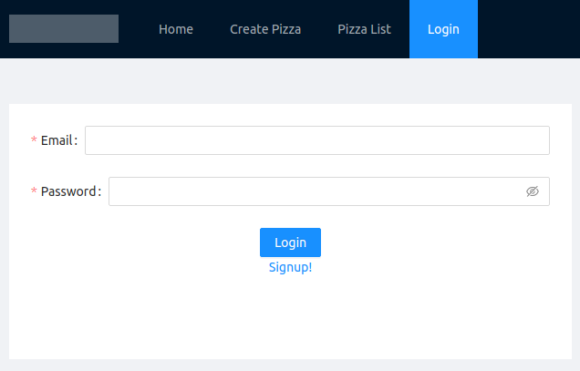
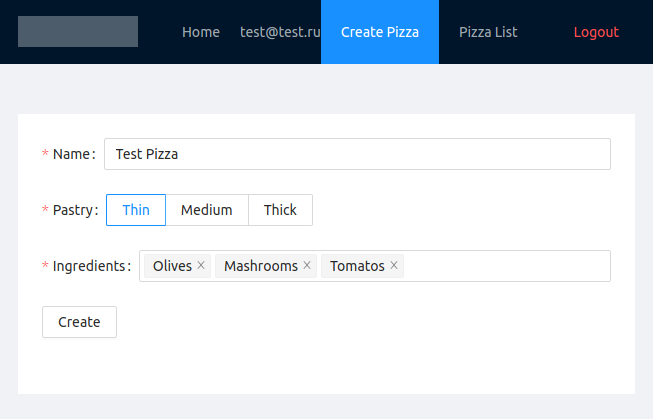
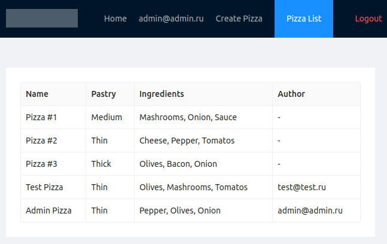

# Pizza App
The full-stack application that allows users to create a pizzas and store it in the DB. There is an authentication and authorization system. User can be the admin. Everybody can create pizzas but only admin has access to the "Pizza List" page.
## Credentials
Use following credentials to get access to the app

### user:
> *email:* test@test.com  
> *password:* test  

### admin:
> *email:* admin@admin.com  
> *password:* admin  


## Requirements
* Docker
* Network accessible web server hosting the docker binary.
* For Linux: docker-compose should be installed.

## Run development environment:
To get start just run this command from project folder:
```
(proj)$ sudo docker-compose up

```
and get acces to the app on http://localhost:3050/


# Features

### Login
Simple signin/signup form  


### Create Pizza
Here you can create a new pizza  


### Create Pizza
This page accessable for admins only. Here you can see the list of all pizzas in the DB  


## Tech Stack & Technologies
* React
* Ant Design
* JWT
* Node.js
* Express
* MongoDB
* Docker
* Nginx